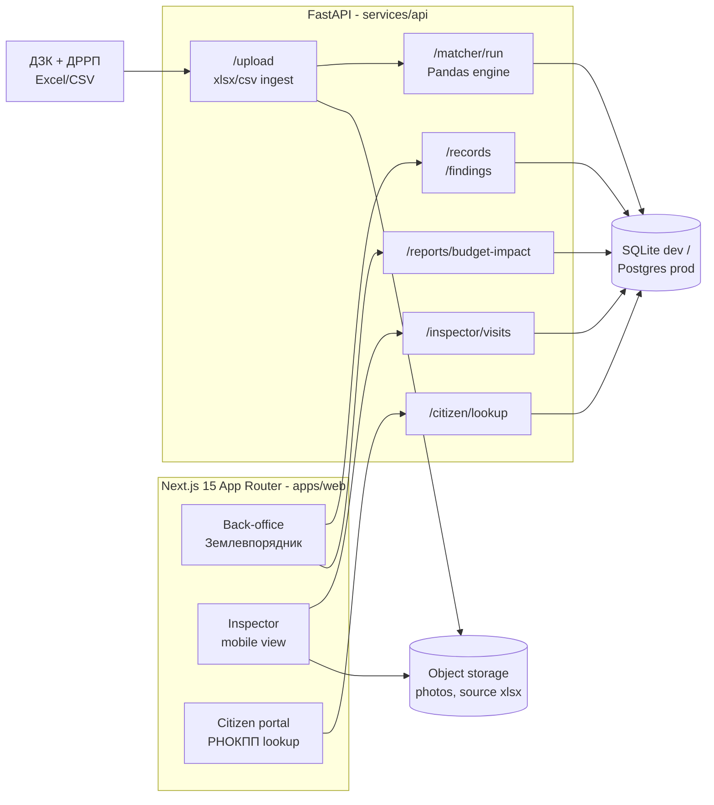
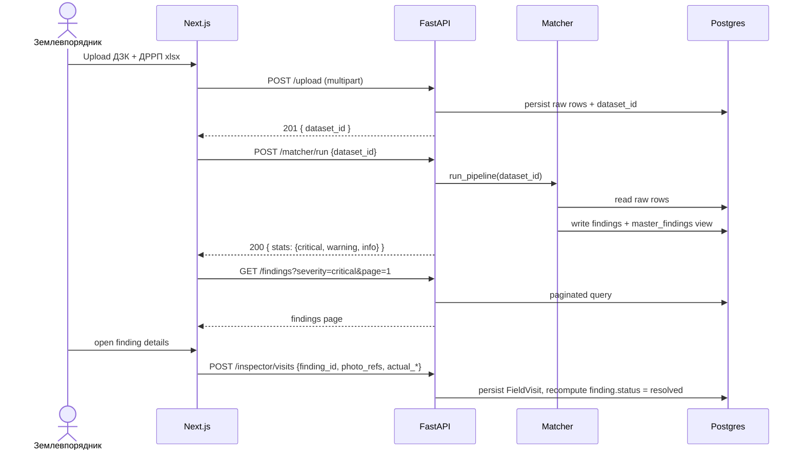

# E-State — System Architecture

> Companion to [PRD.md](PRD.md). Canonical source of truth for module boundaries, data flow and deployment topology. All implementation docs (data-model, matcher, API contract) extend this overview.

## 1. High-level overview

E-State is a monorepo with a clean split between a **stateless Next.js web layer** and a **FastAPI + Pandas data service**. The data service owns ingestion, matching, and persistence; the web layer is a thin UI that never talks to the database directly.



## 2. Repository layout

```
apps/
  web/                         Next.js 15 App Router
    src/app/(back-office)/     Землевпорядник routes
    src/app/(inspector)/       Mobile-first inspector routes
    src/app/(citizen)/         Public citizen portal
    src/lib/api/               Generated OpenAPI TS client + types
    src/i18n/uk.ts             All user-facing UI strings (Ukrainian)
services/
  api/
    app/
      ingest/                  Excel/CSV readers, normalizers
      matcher/                 Pandas + rapidfuzz engine
        detectors/             One module per finding_type
        config.py              Thresholds, enums
      domain/                  Pure business objects (persons, parcels, findings)
      db/                      SQLAlchemy models + Alembic migrations
      api/                     FastAPI routers (one per domain)
      security/                Auth, РНОКПП masking, audit log
    tests/
      fixtures/                Tiny CSV golden sets derived from real data
      matcher/                 One test module per detector
data/
  samples/                     Source xlsx/csv snapshots (gitignored)
docs/                          This folder
```

## 3. Module responsibilities

| Module | Owns | Depends on |
|---|---|---|
| `ingest` | Reading xlsx/csv, column normalization, Excel-serial → ISO date, га → m² | `domain` |
| `matcher` | Pure DataFrame-in / Findings-out pipeline (see [data-matcher-spec.md](data-matcher-spec.md)) | `domain`, `config` only |
| `domain` | Typed records for `Person`, `LandParcel`, `RealEstate`, `Finding`, `FieldVisit` | Nothing |
| `db` | SQLAlchemy models mirroring `domain`, migrations via Alembic | `domain` |
| `api` | Thin FastAPI routers, request/response DTOs, no business logic | `matcher`, `db`, `security` |
| `security` | JWT for staff, РНОКПП masking in logs, audit-log writer | — |
| `apps/web` | UI only. Never reaches DB directly. Calls generated OpenAPI client. | `api` (via HTTP) |

Invariant: **business logic lives in `matcher` and `domain`, not in `api` routers, not in React components**.

## 4. Runtime data flow



## 5. Tech choices (locked)

| Layer | Choice | Why |
|---|---|---|
| Backend | FastAPI (Python 3.12) | Native Pandas interop, fast to ship, generates OpenAPI |
| Data core | Pandas + rapidfuzz | Single-process in-memory is fine for ОТГ-scale (≤100k rows) |
| DB | SQLite dev / Postgres prod | Hackathon speed today, multi-tenant SaaS tomorrow |
| Web | Next.js 15 App Router + Tailwind + Shadcn/ui | Matches [design-brief.md](design-brief.md), SSR for citizen portal SEO |
| Icons | Lucide-React | Thin stroke, matches brief |
| Auth | JWT (staff), no auth on citizen portal (rate-limited + CAPTCHA) | MVP scope |
| Package managers | `uv` (Python), `npm` (JS) | See [setup.md](setup.md) |

## 6. Deployment topology

| Component | Target | Notes |
|---|---|---|
| `apps/web` | Vercel | `NEXT_PUBLIC_API_URL` points at API host |
| `services/api` | Fly.io or Render (container) | Persistent volume for SQLite in dev; managed Postgres in prod |
| Object storage | S3-compatible (Cloudflare R2 or Supabase Storage) | For inspector photos and original xlsx uploads |
| Secrets | Platform env vars only; never committed | See [.env.example](../services/api/.env.example) generated by setup |

## 7. Cross-cutting concerns

- **Auditability.** Every write to `master_findings`, `field_visits`, or citizen lookup writes a row to `audit_log` (see [data-model.md](data-model.md)).
- **PII.** РНОКПП never appears in URLs, query strings, or client logs. See [legal-compliance.md](legal-compliance.md) and the `e-state-pii` rule.
- **Determinism.** The matcher is idempotent; rerunning on the same dataset yields identical findings (see [data-matcher-spec.md](data-matcher-spec.md)).
- **Internationalization.** Code and identifiers are English; user-facing strings are Ukrainian via `src/i18n/uk.ts`.

## 8. What is explicitly out of scope for MVP

- Real-time collaboration / WebSockets.
- Role-based fine-grained permissions beyond `staff` vs `citizen`.
- Satellite-imagery ingestion (see [roadmap.md](roadmap.md) v1).
- Дія integration (see [roadmap.md](roadmap.md) v2).
