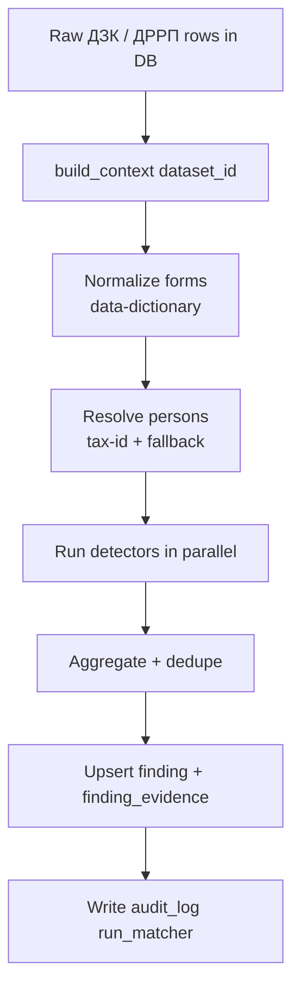

# E-State — Data Matcher Specification

> Authoritative algorithm spec. Extends [data-dictionary.md](data-dictionary.md) and [data-model.md](data-model.md). Every rule here is enforceable by the `e-state-data-matcher` Cursor rule.

## 1. Mission

Given an ingested `dataset_id` (normalized ДЗК + ДРРП rows in `land_parcel` and `real_estate`), produce the complete set of `finding` rows per [data-model.md §2.5](data-model.md#25-finding) with stable IDs, explainable `computed_metrics`, and zero side effects outside the matcher's own tables.

## 2. Hard rules (rule-enforced)

1. **Join key is taxpayer ID.** Primary join is `land_parcel.owner_tax_id == real_estate.owner_tax_id`. Fallback is normalized-name equality — see §5. **There is no cadastral number in ДРРП** on the real dataset; no detector may assume one.
2. **Pure functions on DataFrames.** Every detector is `def detect(ctx: MatcherContext) -> list[Finding]`. It takes read-only inputs, returns new `Finding` objects, and never calls the DB directly.
3. **`.copy()` at boundaries.** Any DataFrame received from the ingest layer is copied before mutation. Inputs are never mutated.
4. **Deterministic & idempotent.** Re-running on an unchanged dataset produces identical `(person_tax_id, finding_type, severity, computed_metrics)` tuples; `UNIQUE(dataset_id, person_tax_id, finding_type)` enforces this at the DB level.
5. **Every finding carries `computed_metrics` + `evidence_refs`.** Findings without numeric justification are rejected at runtime.
6. **Thresholds in `matcher/config.py`.** No magic numbers in detector code.
7. **One detector per file** under `services/api/app/matcher/detectors/`.

## 3. Pipeline



`MatcherContext` is a frozen dataclass:

```python
@dataclass(frozen=True)
class MatcherContext:
    dataset_id: UUID
    zem: pd.DataFrame         # canonical land_parcel rows
    ner: pd.DataFrame         # canonical real_estate rows
    persons: pd.DataFrame     # resolved persons
    config: MatcherConfig
```

## 4. Canonical thresholds

Baseline values in `matcher/config.py`; tune per ОТГ later via env.

```python
@dataclass(frozen=True)
class MatcherConfig:
    name_fuzz_min: float = 0.92            # rapidfuzz token_set_ratio / 100
    owner_name_mismatch_max: float = 0.85  # below this, flag mismatch
    # Calibrated 2026-04: apartment+garage portfolios caused false positives
    # at the old 1.00/1.25 thresholds because multi-storey houses already
    # exceed their plot footprint.
    area_portfolio_ratio_critical: float = 1.75  # re_m2 / land_m2
    area_portfolio_ratio_warning: float = 1.25
    residential_use_codes: tuple = ("02.01", "02.03")
    garage_use_codes: tuple = ("02.05",)
    commercial_use_codes: tuple = ("03.07",)
    industrial_use_codes: tuple = ("11.02", "11.04")
    agri_use_codes: tuple = ("01.01", "01.03", "01.04", "01.05", "01.06")
    residential_object_types: tuple = (
        "квартира", "житловий_будинок",
    )
    # A house is the only object that "closes" a 02.01/02.03 plot.
    house_object_types: tuple = ("житловий_будинок",)
    garage_object_types: tuple = ("гараж",)
    commercial_object_types: tuple = (
        "нежитлова_будівля", "нежитлове_приміщення",
        "торгова_будівля", "офісна_будівля",
    )
    # Objects whose area meaningfully compares to the owner's plot. Flats and
    # non-residential premises live on OSBB/community land, so they are
    # excluded from AREA_PORTFOLIO_DELTA sums.
    area_comparable_object_types: tuple = (
        "житловий_будинок", "нежитлова_будівля", "гараж",
        "торгова_будівля", "офісна_будівля", "промислова_будівля",
    )
```

## 5. Person resolution

```python
def resolve_persons(zem: DataFrame, ner: DataFrame, cfg: MatcherConfig) -> DataFrame:
    # 1. Union of tax IDs
    ids = pd.concat([zem["owner_tax_id"], ner["owner_tax_id"]]).dropna().unique()
    # 2. Mark source flags
    persons = DataFrame({"tax_id": ids})
    persons["in_zem"] = persons.tax_id.isin(zem.owner_tax_id)
    persons["in_ner"] = persons.tax_id.isin(ner.owner_tax_id)
    # 3. Canonical name = most recent observed, normalized
    # 4. Fallback: for rows with missing tax_id, attempt name-only match within the
    #    same koatuu using rapidfuzz.token_set_ratio >= cfg.name_fuzz_min * 100.
    return persons
```

The fallback path does not fire on the current dataset (0 rows with missing tax ID in ДЗК) but is mandatory for real-world data where the municipality will have messy inputs.

## 6. Detectors

Each section declares: trigger, severity, `computed_metrics` shape, `evidence_refs` shape, and expected volume on the current dataset (from the exploration done during planning — used as test-assertion hints).

### 6.1 `LAND_NO_REAL_ESTATE`

- **Trigger:** person has at least one `land_parcel` with `intended_use_code ∈ residential_use_codes` AND **no** active `real_estate` row with `object_type_norm ∈ house_object_types` (i.e. a `житловий_будинок`). An apartment does **not** satisfy the requirement — a flat sits on OSBB/community land, not on this person's 02.01/02.03 plot, so the house that should stand on their plot is still missing from ДРРП.
- **Severity:** `warning`.
- **Metrics:** `{residential_parcels: int, total_residential_m2: float}`.
- **Evidence:** land parcel ids used.
- **Real-dataset signal:** fires for persons like `Пастернак Віталій Олександрович` (02.01 land, ДРРП only has `iнше`).

### 6.2 `REAL_ESTATE_NO_LAND`

- **Trigger:** person has active `real_estate` but no `land_parcel` at all. (On our dataset: 0 — ДРРП is a subset of ДЗК owners. Detector still ships for production.)
- **Severity:** `warning`.
- **Metrics:** `{active_objects: int, total_re_m2: float}`.
- **Evidence:** real-estate ids.

### 6.3 `USE_VS_OBJECT_MISMATCH`

- **Trigger:** person has land with `intended_use_code ∈ agri_use_codes` AND real estate with `object_type_norm ∈ commercial_object_types` at a matching КОАТУУ. Suggests a commercial building standing on farmland.
- **Severity:** `critical`.
- **Metrics:** `{agri_use_codes: [...], conflicting_object_types: [...]}`.
- **Evidence:** both sides.

### 6.4 `AREA_PORTFOLIO_DELTA`

- **Trigger:** `re_m2_comparable / land_m2 > area_portfolio_ratio_critical` (critical) or `> area_portfolio_ratio_warning` (warning). `re_m2_comparable` sums only non-terminated ДРРП objects whose `object_type_norm ∈ area_comparable_object_types`. Apartments and non-residential premises are **excluded** because they stand on OSBB/community land, not on the individual owner's plot — including them produced false positives such as "garage parcel 27 m² + flat 95.8 m² → ratio 3.55 critical". `land_m2` sums all land area in m² (га × 10 000).
- **Severity:** `critical` or `warning` per threshold.
- **Metrics:** `{zem_m2, ner_m2, ratio, delta_m2}`.
- **Evidence:** all parcels + the comparable active real-estate ids whose area was counted.
- **Real-dataset signal:** `Хоцевич Григорій Степанович` — land 903 m², comparable real-estate ≈ 6 989 m², ratio ≈ 7.74 → `critical`.

### 6.5 `OWNER_NAME_MISMATCH`

- **Trigger:** same `tax_id`, `rapidfuzz.token_set_ratio(zem_name_norm, ner_name_norm) < owner_name_mismatch_max * 100`.
- **Severity:** `warning`.
- **Metrics:** `{zem_name, ner_name, ratio}`.
- **Evidence:** one parcel + one real-estate id.
- **Real-dataset signal:** 0 on provided data (names are clean); must still ship.

### 6.6 `TERMINATED_BUT_ACTIVE`

- **Trigger:** `real_estate.terminated_at IS NOT NULL` AND `real_estate.terminated_at < today` AND the record still appears in downstream counts without a termination marker.
- **Severity:** `info` (by itself; promoted to `warning` when combined with other findings for the same person).
- **Metrics:** `{terminated_at, object_type_norm, area_m2}`.
- **Evidence:** one real-estate id.
- **Real-dataset signal:** 5 080 rows in ДРРП carry a termination date — this detector hydrates a large bucket for the demo.

### 6.7 `MISSING_OWNER`

- **Trigger:** ДЗК row with empty or invalid `owner_tax_id`.
- **Severity:** `critical`.
- **Metrics:** `{cadastral_no, koatuu, area_m2}`.
- **Evidence:** one parcel id.
- **Real-dataset signal:** 0 on provided data. Detector ships to catch real-world data-quality issues.

### 6.8 `DUPLICATE_REGISTRATION`

- **Trigger:** `cadastral_no` appears more than once in ДЗК with conflicting `owner_tax_id`.
- **Severity:** `critical`.
- **Metrics:** `{cadastral_no, tax_ids: [...]}`.
- **Evidence:** all conflicting parcels.
- **Real-dataset signal:** 0 on provided data; detector still required because duplicate filings are the #1 real-world integrity failure.

### 6.9 `TERMINATED_RIGHTS_MISMATCH`

- **Trigger:** person has **any** `real_estate` row with `terminated_at IS NOT NULL` AND still holds at least one active `land_parcel` under the same `owner_tax_id`.
- **Severity:** `warning`.
- **Metrics:** `{terminated_count: int, last_termination_at: ISO8601, land_status: "active"}`.
- **Evidence:** all terminated real-estate ids for that owner + all their active parcels.
- **Volume note:** **one finding per owner**, not per terminated row. An owner with three sold flats produces a single finding with `terminated_count = 3`; prior to April 2026 this detector emitted one per row and flooded the inspector queue.

### 6.10 `LAND_NO_GARAGE`

- **Trigger:** person has at least one `land_parcel` with `intended_use_code ∈ garage_use_codes` (02.05) AND **no** active `real_estate` row with `object_type_norm ∈ garage_object_types`.
- **Severity:** `warning`.
- **Metrics:** `{garage_parcels: int, total_garage_m2: float}`.
- **Evidence:** the owner's garage-purpose parcels.
- **Rationale:** mirrors §6.1 for garage-purpose plots. A cooperative garage parcel without any registered `гараж` usually signals an unregistered structure or a stale ДРРП export.

## 7. Budget-impact model (stretch, used by `/reports/budget-impact`)

Per finding, compute an `expected_tax_uplift_uah` on `computed_metrics` using a conservative table:

| finding_type | uplift formula |
|---|---|
| `USE_VS_OBJECT_MISMATCH` | `re_m2 * commercial_rate_uah_per_m2_per_year` |
| `LAND_NO_REAL_ESTATE` | `total_residential_m2 * housing_rate_uah_per_m2_per_year` |
| `AREA_PORTFOLIO_DELTA` | `(re_m2 - land_m2 * ratio_warning) * housing_rate_uah_per_m2_per_year` |
| `MISSING_OWNER` | `area_m2 * agri_rate_uah_per_m2_per_year` |

Rates live in `matcher/config.py` and are documented with a source link in the config module. The goal is transparency, not accuracy.

## 8. Testing strategy

Mandatory test modules in `services/api/tests/matcher/test_<detector>.py`:

1. **Golden-set CSVs** in `services/api/tests/fixtures/` built as small slices of the real dataset (e.g. `sample_land_no_re.csv`, `sample_area_delta.csv`). Keep each fixture under 30 rows.
2. For each detector:
   - `test_<detector>_fires_on_positive_sample` — asserts at least one finding with the right `computed_metrics` keys.
   - `test_<detector>_ignores_negative_sample` — asserts no false positive on a clean control fixture.
   - `test_<detector>_is_idempotent` — run twice, expect identical findings.
3. A smoke test runs the full pipeline on the full real dataset and asserts the known baselines (`LAND_NO_REAL_ESTATE` non-empty, `TERMINATED_BUT_ACTIVE` ≈ 5 080, `MISSING_OWNER` == 0, `DUPLICATE_REGISTRATION` == 0). Baselines live in `tests/baselines.json` so they can be refreshed explicitly when source data changes.

## 9. Performance targets

- Full pipeline on 21 656 × 20 382 rows completes in **< 10 s** on a dev laptop.
- Memory peak < 500 MB.
- Everything is vectorized Pandas or `groupby` — no per-row Python loops except inside `rapidfuzz` fallbacks.

## 10. Explicitly out of scope

- ML-based address matching (street geocoding, edit distance on admin hierarchies) — not needed given taxpayer-ID join.
- Cross-dataset historical diffs — each `dataset_id` is evaluated independently.
- Propagating `field_visit` conclusions back into detector logic — the inspector resolves a finding but does not retrain the matcher.
