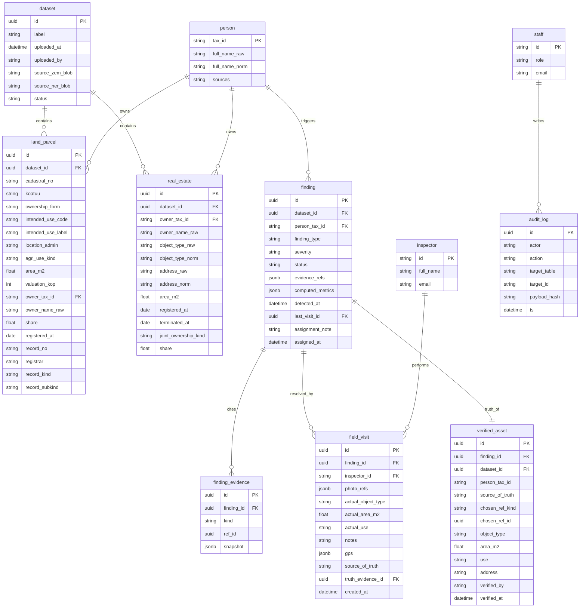

# E-State — Data Model

> Canonical storage schema. Source-of-truth for SQLAlchemy models, Alembic migrations, and the Next.js OpenAPI client types. Extends [data-dictionary.md](data-dictionary.md) (field-level) and [architecture.md](architecture.md) (module-level).

## 1. Overview

The model is **person-centric** rather than parcel-centric. A `Finding` is one detected discrepancy on one person's portfolio, not one row of raw data. This choice follows directly from the real dataset: ДРРП has no cadastral key, so the only stable join is the taxpayer.



## 2. Tables

### 2.1 `dataset`

One upload batch (pair of xlsx files). All downstream rows reference `dataset_id` so the matcher can rerun on a single dataset in isolation.

| Column | Type | Notes |
|---|---|---|
| `id` | `uuid` PK | |
| `label` | `text` | Human-readable, e.g. `"Сокаль 2026-04-18"` |
| `uploaded_at` | `timestamptz` | |
| `uploaded_by` | `text` | Staff email |
| `source_zem_blob` | `text` | Object-storage key of the original ДЗК file |
| `source_ner_blob` | `text` | Object-storage key of the original ДРРП file |
| `status` | enum | `ingesting | matched | failed` |

### 2.2 `person`

Union of taxpayer IDs across both registries. Deduplicated on `tax_id`.

| Column | Type | Notes |
|---|---|---|
| `tax_id` | `text` PK | ЄДРПОУ / РНОКПП as string (leading zeros preserved) |
| `full_name_raw` | `text` | Most recent observed |
| `full_name_norm` | `text` | Per [data-dictionary.md §7](data-dictionary.md#7-owner-name-normalization) |
| `sources` | `text[]` | Subset of `{"dzk", "drrp"}` |

### 2.3 `land_parcel`

One row per ДЗК record. Columns mirror the data-dictionary cross-walk.

Indexes:

- `idx_land_parcel_owner_tax_id` on `owner_tax_id`
- `idx_land_parcel_cadastral` on `cadastral_no`
- `idx_land_parcel_dataset` on `dataset_id`

### 2.4 `real_estate`

One row per ДРРП record.

Indexes:

- `idx_real_estate_owner_tax_id` on `owner_tax_id`
- `idx_real_estate_dataset` on `dataset_id`
- Partial index `idx_real_estate_active` on `(owner_tax_id)` where `terminated_at IS NULL`

### 2.5 `finding`

One row per detected discrepancy on one person.

| Column | Type | Notes |
|---|---|---|
| `id` | `uuid` PK | |
| `dataset_id` | `uuid` FK | |
| `person_tax_id` | `text` FK | |
| `finding_type` | enum | See list below |
| `severity` | enum | `critical | warning | info` |
| `status` | enum | `open | in_review | resolved | dismissed` |
| `evidence_refs` | `jsonb` | `{land_parcel_ids: [...], real_estate_ids: [...]}` |
| `computed_metrics` | `jsonb` | Detector-specific numbers (e.g. `{land_m2: 903, re_m2: 6989.7, ratio: 7.74}`) |
| `detected_at` | `timestamptz` | |
| `last_visit_id` | `uuid` FK nullable | Latest resolving visit |
| `assignment_note` | `text` nullable | Free-text note written by the analyst when handing the finding off for field inspection. Persisted here (not only in `audit_log`, which stores payload hashes) so the inspector can read it. |
| `assigned_at` | `timestamptz` nullable | Set when the analyst transitions the finding from `open` to `in_review`. |

`finding_type` enum (authoritative, mirror in [data-matcher-spec.md](data-matcher-spec.md)):

```
LAND_NO_REAL_ESTATE
REAL_ESTATE_NO_LAND
USE_VS_OBJECT_MISMATCH
AREA_PORTFOLIO_DELTA
OWNER_NAME_MISMATCH
TERMINATED_BUT_ACTIVE
MISSING_OWNER
DUPLICATE_REGISTRATION
```

Uniqueness: `UNIQUE(dataset_id, person_tax_id, finding_type)` — re-running the matcher on the same dataset upserts rather than duplicating.

### 2.6 `finding_evidence`

Denormalized snapshot of the exact raw values at detection time so findings remain explainable even after source data changes.

| Column | Type |
|---|---|
| `id` | `uuid` PK |
| `finding_id` | `uuid` FK |
| `kind` | `land_parcel | real_estate` |
| `ref_id` | `uuid` |
| `snapshot` | `jsonb` |

### 2.7 `field_visit`

Inspector's resolution of a finding.

| Column | Type | Notes |
|---|---|---|
| `id` | `uuid` PK | |
| `finding_id` | `uuid` FK | |
| `inspector_id` | `text` FK | |
| `photo_refs` | `jsonb` | `[{blob_key, width, height, sha256}]` |
| `actual_object_type` | `text` | Free-form |
| `actual_area_m2` | `float` nullable | |
| `actual_use` | `text` | What is actually on the parcel |
| `notes` | `text` | |
| `gps` | `jsonb` | `{lat, lng, acc_m}` |
| `source_of_truth` | enum nullable | `dzk | drrp | field_override`. Which registry (or the inspector's own measurement) the inspector confirmed reflects reality. |
| `truth_evidence_id` | `uuid` FK nullable | Points at the `finding_evidence` row that the inspector accepted as truth. Required when `source_of_truth in {dzk, drrp}`; `null` for `field_override`. |
| `created_at` | `timestamptz` | |

Writing a `field_visit` row with `resolution="resolved"` does three things:

1. Transitions the linked `finding.status` to `resolved` and sets `finding.last_visit_id`.
2. Validates that `truth_evidence_id` (when required) belongs to this finding and that its `kind` matches the chosen `source_of_truth` (`dzk -> land_parcel`, `drrp -> real_estate`).
3. **Upserts `verified_asset` (§2.10) — the canonical "main table" of verified truth.**

### 2.8 `verified_asset`

The canonical main table of inspector-verified truth. **Downstream surfaces (analyst finding detail, reports, optionally the citizen portal) should prefer a `verified_asset` row over the raw registry snapshots whenever one exists**, because it represents the ground truth after a field visit.

| Column | Type | Notes |
|---|---|---|
| `id` | `uuid` PK | |
| `finding_id` | `uuid` FK UNIQUE | One authoritative record per finding. Re-submitting a visit overwrites the previous verdict. |
| `dataset_id` | `uuid` FK | Propagated from the finding for cheap per-dataset joins. |
| `person_tax_id` | `text` | Propagated from the finding. |
| `source_of_truth` | enum | `dzk | drrp | field_override` |
| `chosen_ref_kind` | `text` nullable | `land_parcel | real_estate`. Null when `source_of_truth = field_override`. |
| `chosen_ref_id` | `uuid` nullable | FK-like pointer into `land_parcel.id` or `real_estate.id`, depending on `chosen_ref_kind`. Not enforced as an FK so a later re-upload that deletes the source row does not cascade away the verified record. |
| `object_type` | `text` nullable | Copied from the chosen evidence snapshot (or from the inspector's `actual_*` fields when `source_of_truth = field_override`). |
| `area_m2` | `float` nullable | Same sourcing rule as above. |
| `use` | `text` nullable | Same sourcing rule as above. |
| `address` | `text` nullable | Same sourcing rule as above. |
| `verified_by` | `text` | `inspector_id` that signed off. |
| `verified_at` | `timestamptz` | |

### 2.9 `inspector` and `staff`

Minimal user tables. MVP uses a single shared secret per role; production swaps in OIDC.

### 2.10 `audit_log`

Append-only, write-only-via-trigger. Every read of citizen data and every write to `finding` / `field_visit` produces exactly one row.

| Column | Type |
|---|---|
| `id` | `uuid` PK |
| `actor` | `text` (`staff:<email>`, `inspector:<id>`, or `citizen:<masked_tax_id>`) |
| `action` | enum: `create | update | delete | read_citizen | run_matcher` |
| `target_table` | `text` |
| `target_id` | `text` |
| `payload_hash` | `text` | SHA-256 of the serialized payload; never the payload itself |
| `ts` | `timestamptz` |

## 3. Derived views

- `v_findings_table` — joins `finding` + `person` + latest `field_visit` + `verified_asset` for the back-office table. One row per finding. Surfaces verified `object_type` / `area_m2` / `use` when `verified_asset` exists, otherwise falls back to the computed metrics.
- `v_citizen_profile(tax_id)` — returns masked aggregate for the citizen portal. Never exposes other people's records even via joins. Prefers `verified_asset` over `land_parcel` / `real_estate` when available.
- `v_budget_impact(dataset_id)` — sums `computed_metrics->>'expected_tax_uplift'` per `severity`. Used by `/reports/budget-impact`.

## 4. Migration policy

- Alembic migrations only. No raw SQL in the app.
- Additive by default. Destructive migrations require a PR review note.
- Seed data lives in `services/api/tests/fixtures/` and is loaded only in tests and local dev.

## 5. What this schema deliberately does **not** model

- Parcel↔building physical linkage (would require map data we don't have).
- Historical versions of a ДЗК/ДРРП record. `finding_evidence.snapshot` is our audit trail instead.
- Payments, invoices, or actual tax collection — E-State surfaces uplift estimates, the ОТГ's existing billing system collects.
