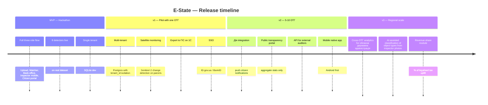

# E-State — Roadmap, Бізнес-модель та Ризики

> Addresses task criteria 1.4 (масштабування + монетизація + ризики) and 1.5 (довгострокове бачення). Keep this doc in lockstep with the business-plan slides.

## 1. Release horizons

## 2. MVP → v1 → v2 — feature delta

| Capability | MVP (hackathon) | v1 (pilot) | v2 (5–10 ОТГ) |
|---|---|---|---|
| Ingestion | xlsx/csv manual upload | Scheduled pull from ДЗК/ДРРП APIs | Streaming ingest on registry updates |
| Matcher | 8 detectors, rapidfuzz | + satellite-change detector | + ML classifier on inspector photos |
| Storage | SQLite | Managed Postgres, per-tenant schema | Sharded Postgres + object store |
| Auth | Shared secret | BankID / ID.gov.ua SSO | Same + inspector mobile FIDO2 |
| UX surfaces | Back-office, Inspector, Citizen | + Голова ОТГ dashboard, Reports export | + Дія push, Native mobile |
| Budget-impact | Heuristic from config rates | Per-ОТГ rate tables | Calibrated rates + historical trends |
| Reporting | CSV/XLSX exports + executive PDF (masked by default, audit logged) | Multi-page PDF packs for депутатів | Public transparency reports (aggregate) |

## 3. Scaling strategy (task 1.4.1)

- **Horizontal:** Same SaaS cluster serves many ОТГ via tenant isolation. Each ОТГ gets a dedicated Postgres schema and object-storage prefix; application-layer middleware enforces `tenant_id` on every query.
- **Onboarding cost:** Target 1–2 days per ОТГ to pilot, because the only inputs are the two xlsx files they already produce. No on-prem install, no IT team dependency.
- **Localisation:** UI already in Ukrainian; copy tables in `apps/web/src/i18n/` allow overrides per область (e.g. terminology differences for гірських громад).
- **Content packs:** `matcher/config.py` profiles per region (farmland ratios, urban vs rural thresholds) ship as named presets.

## 4. Бізнес-модель (task 1.4.2)

Primary: **SaaS subscription per ОТГ**, tiered on population.

| Tier | ОТГ population | Monthly price (UAH) | Included |
|---|---|---|---|
| Starter | < 5 000 | 4 900 | 1 admin, 2 inspectors, up to 4 datasets/month |
| Standard | 5 000 – 20 000 | 12 900 | 3 admins, 6 inspectors, unlimited datasets |
| Pro | 20 000 – 100 000 | 29 900 | + Satellite monitoring, API access |
| Enterprise | > 100 000 / multi-ОТГ | Custom | + SSO, SLA 99.9%, on-prem option |

Secondary revenue streams:

- **Inspector pack** — add-on licence per additional mobile inspector (+ 490 UAH/month/seat).
- **Success fee option** — alternative to subscription: 4–6 % of the first-year tax uplift directly attributable to resolved findings. Tracked via `field_visit` → finding resolution link. Opt-in only because some ОТГ prefer fixed cost.
- **Consulting & customisation** — one-off engagements for bespoke detectors, legacy-registry imports, training.

Unit economics target:

- Gross margin > 75 % at Standard tier (Postgres + object storage + compute per tenant ≤ 2 800 UAH/mo).
- Payback: < 3 months per signed ОТГ.

## 5. Ризики та бар'єри (task 1.4.3)

| Risk | Impact | Mitigation |
|---|---|---|
| ОТГ hesitant to share data with a third party | Adoption | On-prem / dedicated-VPC deployment option; all source xlsx lifecycle-deleted in 90 days; open audit log |
| Data quality — inconsistent КОАТУУ, Latin/Cyrillic mixup in object types | False positives/negatives | Normalization layer documented in [data-dictionary.md](data-dictionary.md); tests against real samples; tuneable thresholds |
| Legal ambiguity about auto-matching РНОКПП across registries | Regulatory | Reading documented in [legal-compliance.md](legal-compliance.md); ОТГ юрист sign-off pre-pilot; no registry writes |
| Inspector workload / change management | Operational | Mobile flow optimised for 5 min/visit; clear prioritisation by severity; training materials |
| False accusation of a citizen | Reputational | "Presumption of regularity" UI language; reopening window; no public shaming |
| Competitor: bespoke 1С modules from incumbents | Commercial | Faster onboarding (days vs months), modern UX, open API, pay-as-you-go |
| Funding gap before 10-ОТГ scale | Financial | Bootstrap-friendly: low fixed cost, per-tenant SaaS pricing covers infra from tenant #1 |
| Registry API changes | Technical | Adapter pattern in `ingest/`; one module per source format |
| Burn-out for inspectors | People | Caseload capped per day; satisfaction nudges in UI; GPS and photo evidence protect both the inspector and the owner |

## 6. Довгострокове бачення (task 1.5)

E-State evolves in three arcs:

1. **From audit to lifecycle.** Today we find stale records. Next we help the ОТГ *manage* the lifecycle: alerts on new registrations, automatic cross-checks when new buildings appear in satellite imagery, prompts to the citizen to update their own data.
2. **From one ОТГ to the system.** Aggregate, anonymised signals become a tool for обласна державна адміністрація and ministerial oversight (with explicit consent from each ОТГ). This is where the strategic moat forms.
3. **From compliance to revenue.** Once data is trustworthy, E-State surfaces *opportunities* (unused communal parcels suitable for leasing, underused buildings) instead of only discrepancies.

## 7. Additional opportunities (task 1.5.2)

- **"Дія" integration** for zero-touch citizen notifications and record corrections.
- **Open GIS overlay** on top of ДЗК parcels so ОТГ staff can visualise findings on a map.
- **Satellite-change detection** via Sentinel-2 diffs — flags new constructions that have no building permit.
- **Partnership with Державна податкова служба** to close the loop between finding → corrected registry → tax billing.
- **Ecosystem partnerships** with ЦНАП networks, обласні центри надання адмінпослуг, and notary associations for a referral pipeline.
- **Academic collaboration** with faculties of кадастру та землевпорядкування — free licence in exchange for anonymised research data.

## 8. Success metrics (per task 2.2.3, "practical value")

Rolling targets once v1 launches:

- ≥ 12 % of detected findings resolved within 30 days.
- ≥ 90 % inspector-satisfaction on the mobile flow.
- ≥ 8 % measured tax uplift in pilot ОТГ within 12 months.
- Data-quality score: share of ДРРП records with a valid, active `owner_tax_id` and no termination flag trending up month-over-month.
