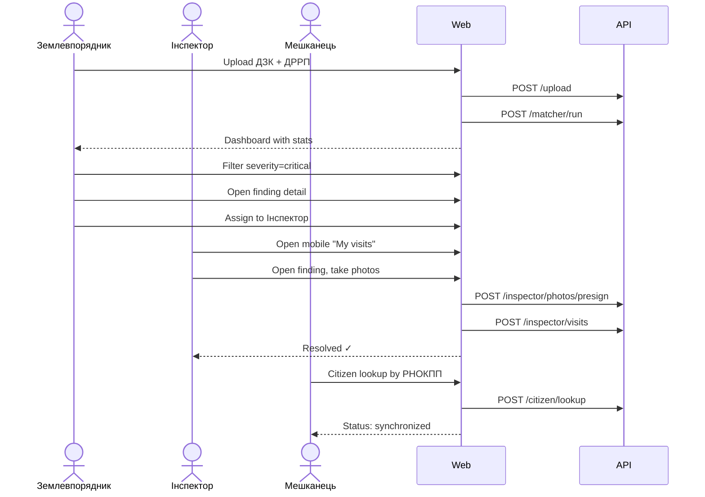
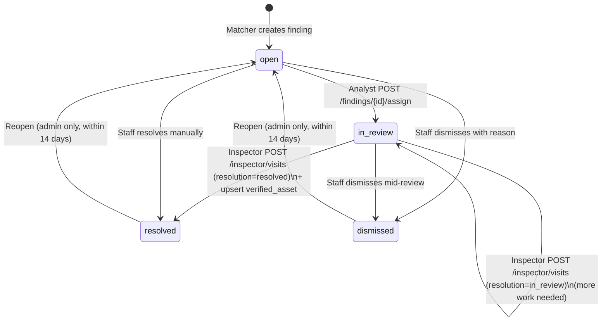

# E-State — User Flows

> Concrete step-by-step flows mapped to screens from [design-brief.md](design-brief.md). Source of truth for route layout in `apps/web`, navigation, and state transitions. Each screen references the API endpoints defined in [api-contract.md](api-contract.md).

## 1. Personas

| Persona | Role | Primary device | Access |
|---|---|---|---|
| Землевпорядник | Staff — back-office analyst | Desktop | JWT, full access |
| Інспектор | Staff — field auditor | Mobile phone | JWT scoped to assigned findings |
| Мешканець | Citizen | Mixed (often mobile) | Unauthenticated + CAPTCHA |
| Голова ОТГ / Депутат | Staff — read-only | Desktop | JWT, read-only on `/reports/*` |

## 2. End-to-end happy path

## 3. Back-office flow (Землевпорядник)

Routes under `apps/web/src/app/(back-office)/`.

### 3.1 `/` — Dashboard

From [design-brief.md §1](design-brief.md#1-main-dashboard-e-state).

- **Header:** title `E-state`, subtitle `Система виявлення розбіжностей активів ОТГ`.
- **Metrics row:** `Total Records`, `Mismatches Found`, `Files Processed` — pulled from `GET /reports/summary` (not in contract yet; returns counts across all datasets).
- **Primary CTA:** large "Завантажити дані" button → navigates to `/upload`.
- **Recent datasets:** table of the last 10 `dataset` rows with status pill and row counts.

### 3.2 `/upload`

From [design-brief.md §2](design-brief.md#2-upload-interface).

- Drop zone accepting two files (`.xlsx`, `.csv`). Both required before CTA enables.
- Client-side validation: file type + size (< 25 MB each).
- "Почати аналіз" → `POST /upload`, then `POST /matcher/run`, then navigate to `/datasets/:id/findings`.
- Visual states: `Idle → Uploading → Queued → Running matcher → Ready`.

### 3.3 `/datasets/:id/findings`

From [design-brief.md §3](design-brief.md#3-analysis-results-the-workhorse-view).

- **Summary tier:** three Shadcn cards: `Критичні`, `Попередження`, `Інформаційні`.
- **Filters:** severity chips, `finding_type` multiselect, `koatuu` input, free-text person search (debounced 300 ms).
- **Data table:** columns `Особа (masked)`, `Тип розбіжності`, `Severity`, `Locality (koatuu)`, `Виявлено`, `Статус`, `Дії`.
- Status badges map to the design palette per [design-system.md](design-system.md).
- Row click → `/datasets/:id/findings/:findingId`.
- Row actions: `Призначити інспектору`, `Відхилити`.

### 3.4 `/findings/:findingId`

From [design-brief.md §4](design-brief.md#4-record-details-deep-dive).

- **Header:** finding type, severity badge, person full name, status pill.
- **Assignment banner** (when `assigned_at` is set): shows timestamp + the analyst's note to the inspector, green-outlined card using `bg-surface-muted`.
- **Actions card — `Призначити інспектору`:**
  - Expands into a `Textarea` (`Нотатка для інспектора`) + two buttons (`Передати на перевірку`, `Скасувати`).
  - `POST /findings/{id}/assign` with `{ note }`; on 200 the finding status flips to `in_review` and the banner appears.
  - The button is disabled when `status !== "open"` with a subtitle explaining why.
- **Split-screen:** left card `ДЗК` (all the person's `land_parcel` rows for this dataset), right card `ДРРП` (all `real_estate` rows). Divergent fields auto-highlighted using the rose tone from the palette.
- **Finding computed metrics:** plain-language explanation per detector, e.g. for `AREA_PORTFOLIO_DELTA`:
  > Сумарна площа нерухомості (6 989.7 м²) у 7.7 раз перевищує площу земельних ділянок (903 м²).
- **Visits timeline:** chronological list of `FieldVisit` entries; rows that produced a `verified_asset` show the chosen `source_of_truth` badge (`ДЗК`, `ДРРП`, `Огляд`).

### 3.5 `/datasets/:id/reports`

- KPI strip: `Очікуване зростання податкових надходжень`, `Резолюції інспекторів`, `% red→green`.
- Budget-impact chart (Recharts) from `GET /reports/budget-impact`.
- Export button: CSV of the current `findings` filtered view.

## 4. Inspector flow (Інспектор)

Routes under `apps/web/src/app/(inspector)/`, mobile-first. Every page is usable on a 360 px screen with one-handed navigation.

### 4.1 `/inspector` — Assigned visits

- List of findings assigned to the current inspector, sorted by severity → koatuu → distance (if GPS allowed).
- Sticky filter: `Сьогодні`, `Цього тижня`, `Усі`.
- Each card: severity stripe, person name, object type hint, КОАТУУ, address fragment.

### 4.2 `/inspector/:id` — combined detail + visit form

Data source: `GET /inspector/findings/:id` (inspector-scoped; returns 404 for `resolved` findings so the mobile queue stays clean).

Sections, top-to-bottom:

1. **Summary card** — finding type, severity, masked РНОКПП, first 4 computed metrics.
2. **Assignment-note banner** — rendered when `assignment_note` is non-empty. Shows the analyst's free-text guidance. This is the entire reason the note lives on `finding` (not only in `audit_log`): the inspector needs to read it on site.
3. **Compare view — `Що показують реєстри`:** two columns, `ДЗК (земля)` and `ДРРП (нерухомість)`. Each column lists the key fields from the corresponding `finding_evidence.snapshot`. Fields that differ between ДЗК and ДРРП are highlighted with the rose tone (`bg-rose/10`). Each column has an `Обрати як істину` button that selects that snapshot as the source of truth; the selected card gets a forest ring.
4. **Truth-source selector — `Яке джерело відповідає дійсності?`:** three buttons — `Дані ДЗК`, `Дані ДРРП`, `Дані з огляду`. Picking ДЗК/ДРРП auto-fills the `Фактичний тип об'єкта`, `Фактична площа`, `Фактичне використання` fields from the chosen snapshot and marks the inputs `readOnly`. Picking `Дані з огляду` keeps the fields editable so the inspector can record the true state when neither registry is right.
5. **Visit form:** actual object type / area / use / notes + `Автоматичне визначення координат` (fills `gps`) + `Фото на місці` (MVP placeholder, presigned upload comes next iteration).
6. **Resolution toggle:** `Розв'язано` (default) or `Потребує додаткової перевірки`. Only `resolved` submissions upsert into `verified_asset`.

On submit: `POST /inspector/visits` with `{ source_of_truth, truth_evidence_id, resolution, actual_* }`. When `resolution === "resolved"`, the server upserts `verified_asset` — the canonical "main table" — and the response includes the upserted record. On success the client routes back to `/inspector`.

Validation done in the UI before firing the mutation:

- `source_of_truth` is required.
- When `source_of_truth ∈ {dzk, drrp}`, `truth_evidence_id` must be set (enforced by the compare-view selection).

## 5. Citizen flow (Мешканець)

Routes under `apps/web/src/app/(citizen)/`. Public, unauthenticated.

### 5.1 `/citizen`

- Hero with the product promise in citizen-friendly Ukrainian: `Перевірте, чи ваші записи в реєстрах ОТГ актуальні`.
- Explains the law basis and the ОТГ's right to audit (links to [legal-compliance.md](legal-compliance.md) excerpts on a dedicated `/legal` page).
- CTA: `Перевірити за РНОКПП`.

### 5.2 `/citizen/lookup`

- Single form: РНОКПП input (client-side masked while typing), CAPTCHA widget (hCaptcha or Cloudflare Turnstile), submit.
- Result page shows **only** masked tax ID, full name, record counts, and a status badge:
  - `Дані синхронізовано` (green) — no open findings for this person.
  - `Потребує уточнення` (warning) — ≥ 1 open finding on the person; shows citizen-safe summary sentences, never citing neighbours.
  - `Триває перевірка` (info) — a finding is assigned to an inspector.
- Link: `Як оновити дані` — clear instructions to visit ЦНАП or file online, with specific templates.

## 6. State transitions

### 6.1 Source-of-truth contract

When the inspector resolves a finding, they **must** record which source the truth came from. This is persisted in two places:

- `field_visit.source_of_truth` + `field_visit.truth_evidence_id` — the decision itself, kept with the visit record for audit.
- `verified_asset` — the derived canonical record that downstream surfaces (back-office detail, reports, citizen portal) read as the main table. One row per `finding_id`; re-submitting a visit overwrites it.

This way the registry data from ДЗК and ДРРП is never mutated — we keep their snapshots immutable for audit — but everything that reads "what is actually on this parcel" reads the verified row.

## 7. Empty and error states (mandatory)

Every list-backed screen renders explicit states rather than blank space:

| State | What to render |
|---|---|
| Empty (no data) | Illustration + CTA to upload / assign |
| Loading | Skeleton rows, never a spinner-on-blank |
| Error | Message with correlation ID + "Повторити" button |
| Forbidden | Clear explanation of why, link to legal page |

## 8. Accessibility baseline

- All interactive elements reachable by keyboard.
- Visible focus ring matching the primary color at reduced opacity.
- Status is never communicated by colour alone — every badge has a text label and icon.
- Minimum body text 16 px; tables allow horizontal scroll instead of truncation on narrow screens.
